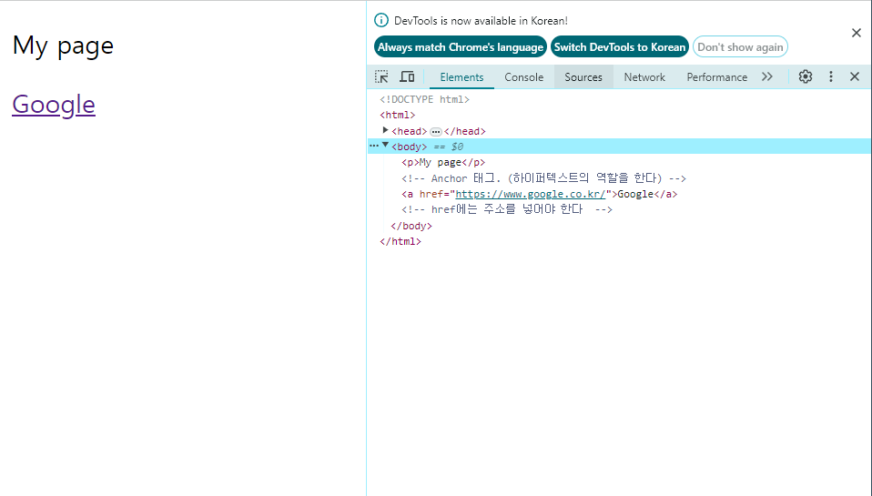
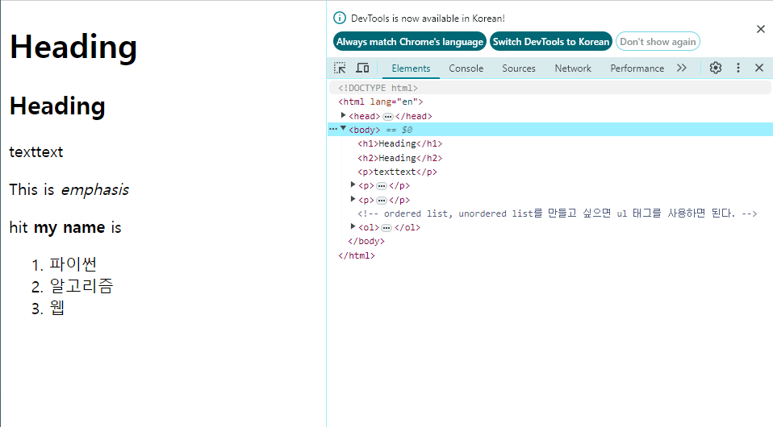

# HTML 

Date : 24-03-06


## HTML 기본
### webpage 구성요소

html : structure

css : styling 

javascript : behavior

### HTML

= HyperText Markup Language

- 웹페이지의 의미와 **구조**를 정의하는 언어

### Hypertext 
- 웹페이지를 다른 페이지로 연결하는 링크 
- 참조를 통해 사용자가 한 문서에서 다른 문서로 즉시 접근할 수 있는 텍스트 

### Markup Language
- 태그 등을 이용해서 데이터의 **구조**를 명시하는 언어 

### HTML 구조 


- `<!DOCTYPE html>` : 해당 문서가 html로 된 문서라는 것을 나타냄
- 우리는 HTML의 바디의 내용만 보고 있다. 
- 개발자도구 켜기 :  ctrl+shift+i


### HTML의 요소 (element)
`<p> my cat is very grumpy </p>`
- 태그 : <p> 는 오프닝 태그, </p>는 클로징태그
- 하나의 요소는 여는 태그와 닫는 태그 그리고 내용으로 구성된다
- 닫는 태그는 태그 앞에 슬래시가 포함되며 닫는 태그가 없는 태그도 존재한다 

### HTML의 속성 (attribute)
`<p> class="editor-note" > my cat is very grumpy </p>`
- 무조건 문자열 형태이다 
- 태그는 ;로 구분하지 않는다.
- 속성만 존재하는 것도 있다. (required.. ) 
- 규칙 
    - 속성은 요소 이름과 속성 사이에 공백이 있어야 한다
    - 하나 이상의 속성들이 있는 경우엔 속성 사이에 공백으로 구분함
    - 속성 값은 열고 닫는 따옴표로 감싸야 함

- 목적
    - 나타내고 싶지는 않지만 추가적인 기능, 내용을 담고 싶을 때 사용
    - css에서 해당 요소를 선택하기 위한 값으로 활용됨


**반드시!!! 개발자도구(F12)를 켜고 디버깅을할것**

## 실습1

### HTML작성하기 
- 태그 이름만 작성해도 자동완성이 된다. ( 꺽쇠 X)
- head 태그는 사용자의 눈에 보이는 부분이 아니다. 
- meta :  문자 인코딩에 관련된 설정이구나 



```html
<!DOCTYPE html>
<html>
<head>
    <meta charset="UTF-8">
    <title>My page</title>
</head>
<body>
    <p>My page</p>
    <!-- Anchor 태그. (하이퍼텍스트의 역할을 한다) -->
    <a href="https://www.google.co.kr/">Google</a>
    <!-- href에는 주소를 넣어야 한다  -->
</body>
</html>
```

- 이미지에는 닫는태그가 없다 
- 닫는 태그가 없다는 것은 컨텐츠가 없다는 뜻(이미지 자체)
- 즉 이미지를 가져올 주소만 필요할 뿐이다. 
``
- alt는 대체 텍스트이다. 


## Text structure
- 텍스트의 구조와 **의미**를 부여해야 한다.


### 태그
- h1 : 사이즈가 크게 나옴 (md에서 #이랑 같은 기능) 단순히 텍스트를 크게만 만드는 것이 아닌 현재 문서의 최상위 제목이라는 의미를 부여하는 것이다. 


```html
<!DOCTYPE html>
<html lang="en">
<head>
    <meta charset="UTF-8">
    <meta name="viewport" content="width=device-width, initial-scale=1.0">
    <title>Document</title>
</head>
<body>
    <h1>Heading</h1>
    <h2>Heading</h2>
    <p>texttext</p>
    <p>This is <em>emphasis</em></p>
    <p>hit <strong>my name</strong> is</p>
    <!-- ordered list, unordered list를 만들고 싶으면 ul 태그를 사용하면 된다. -->
    <ol>
        <li>파이썬</li>
        <li>알고리즘</li>
        <li>웹</li>
    </ol>

</body>
</html>
```

### HTML Text structure
- heading & paragraphs
    - h1~6, p
- lists 
    - ol, ul, li
- emphasis & importance
    - em(기울이기), strong(강조하기)
    - < i >, < b > 가 있지만 의미가 없는 태그이다. 따라서 em, strong을 열심히 쓸것. 


### 엔터
- 태그 안에서는 엔터를 치면 인식을 못함
- br 이라는 태그를 사용한다 


### [mdn 웹 표준문서](https://developer.mozilla.org/ko/)
- 가이드를 볼 수 있는 사이트
- 검색할 때 mdn + 검색어 해주기 
