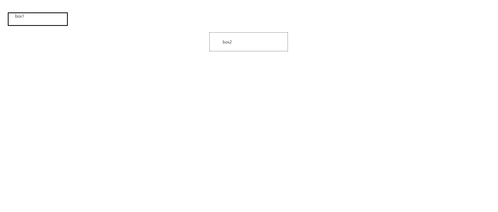

# CSS

## CSS Box Model


### 구성요소

박스의 구조를 html로 잡아준다. 


단독주택을 예로 들어보자 <br>
집은 content, 마당은 padding, 담은 border, 집 밖은 margin


```html
<!DOCTYPE html>
<html lang="en">

<head>
  <meta charset="UTF-8">
  <meta http-equiv="X-UA-Compatible" content="IE=edge">
  <meta name="viewport" content="width=device-width, initial-scale=1.0">
  <title>Document</title>
  <style>
    .box1 {
      width: 200px;
      padding-left: 25px;
      padding-bottom: 25px;
      margin-left: 25px;
      margin-top: 50px;
      border-width: 3px;
      border-style: solid;
      border-color: black;
    }

    .box2 {
      width: 200px;
      padding: 25px 50px;
      margin: 25px auto;
      border: 1px dashed black;
    }
  </style>
</head>

<body>
  <div class="box1">box1</div>
  <div class="box2">box2</div>
</body>

</html>

```
결과 


### width& height
- width 는 content의 길이와 같다. (border의 길이가 아니다!)
- box-sizing : content-box; (컨텐츠 기준)
- box-sizing : border-box;  (테두리 기준)


### 왜 124?


100(컨텐츠)+20(경계)+4(border두께)

### Normal Flow 
- 기본 배치 방향
- CSS를 적용하지 않았을 경우 웹페이지 요소가 기본적으로 배치되는 방향
- 블록요소가 오른쪽을 다 차지고 있기 때문에 아래로 요소가 나오게 된다. 

## 기타 display속성 

### block 타입 특징
- 항상 새로운 행으로 나뉨
- width와 height 속성을 사용하여 너비와 높이를 지정할 수 있음
- 기본적으로 width 속성을 지정하지 않으면 박스는 inline방향으로 사용 가능한 공간을 모두 차지함(너비를 사용 가능한 공간의 100%로 채운다 )
- h1~6, p, div


### inline타입 특징
- 새로운 행으로 나뉘지 않음
- width와 height 속성을 사용할 수 없음
- 수직방향 
    - padding, margins, borders가 적용되지만 다른 요소를 밀어낼 수는 없음
- 수평방향 
    - padding, margins, borders가 적용되어 다른 요소를 밀어낼 수 있음
- 대표적인 inline 타입 태그 
    - a, img, span


### 속성에 따른 수평 정렬
- content의 위치를 정하기 위해서는 margin의 위치를 정해줘야한다. 
- 개발자 도구를 이용해서 체크를 해야한다. 해당 정렬된 부분을 확인하고 공간이 얼마나 주어졌는지 확인해야한다. 

### display : none
- 반응형 레이아웃에 사용이 된다. 
- 요소를 화면에 표시하지 않고 공간조차 부여되지 않음


### shorthand 참고
- shorthand속성 - border
    -  width, style, color을 한번에 설정할 수 있음 
- shorthand속성 - margin & padding
    - 4방향의 속성을 각각 지정하지 않고 한번에 지정할 수 있는 속성 
    - 4개 : 상우하좌
    - 3개 : 상/좌우/하
    - 2개 : 상하/좌우
    - 1개 : 4방향 다

- margin collapsing
    - 두 block 타입 요소의 margin top과 bottom 이 만나 더 큰 margin으로 결합되는 현상
    - 예를들어 margin top에 30 margin bottom 에 10이면 40이 아니라 30으로 합쳐진다는 뜻
    - 웹 개발자가 레이아웃을 더욱 쉽게 관리할 수 있도록 한다 


## CSS Position
### CSS Layout 
- 각 요소의 위치와 크기를 조정하여 웹페이지의 디자인을 결정하는 것
- static 
    - 기본값
    - 요소를 Normal Flow에 따라 배치
- absolute 
    - 요소를 Normal Flow에 따라 제거(normal flow를 따르지 않는다.)
    - 새로운 기준점을 찾아야 한다. 
    - static이 아니면 된다. 만약 모든 body가 static이면 body를 기준으로한다.
- relative 
    - 요소를 Normal Flow에 따라 배치
    - 원래 위치를 유지를 한다. 이동 기준 전은 원래 위치를 기준으로 한다. 
    - 요소가 차지하는 공간은 static 일때와 같음 
- fixed
    - Normal Flow를 따르지 않는다
    - 현재 화면 영역을 기준으로 이동
    - 문서에서 요소가 차지하는 공간이 없어짐
- sticky
    - Normal Flow를 따른다
    - 화면을 벗어나면 특정 위치에 고정이 된다. 
    - 요소가 일반적인 문서 흐름에 따라 배치되다가 스크롤이 특정 임계점에 도달하면 그 위치에서 고정됨
    - 만약 다음 sticky요소가 나오면 다음 sticky요소 가 이전 sticky요소의 자리를 대체한다 


### Z- index
- 요소가 겹쳤을 때 어떤 요소 순으로 위에 나타낼 지 결정 

## CSS Flexbox
- 요소를 행과 열 형태로 배치하는 1차원 레이아웃 방식
- 공간 배열 & 정렬
- position은 하나를 들고 하나하나 
- 조금 더 여러개의 요소를 행, 열 기준으로 배치하는 것이다. 


### Flexbox 구성요소 

부모요소가 자식 요소를 정렬하는 것. 

- main axis(주축)
    - main 축과 cross 축이 있다. 
    - flex item 들이 배치되는 기본 축이다
    - main start에서 시작하여 main end 방향으로 배치한다

- cross axis(교차축)
    - main axis에 수직인 축
    - cross start 에서 시작하여 cross end 방향으로 배치

- Flex item 
    - (display : flex or display: inline-flex) 가 설정된 부모요소
    - 이 안의 자식 요소들이 flex item이 된다.
    - flex container 내부에 레이아웃 되는 항목 


### 레이아웃 구성 
1. flexcontainer
2. flex-direction
3. flex-wrap
4. justify-content
5. align-content
    - 여러 행일 때 실질적으로 보여지는 속성
    - 교차축을 따라 flex item과 주위에 공간을 분배한다 
6. align-items
    - 행을 정렬
7. align-self
    - 축을 붙이고 싶은데다가 붙임
8. flex-grow
    - 남는 행 여백을 비율에 따라 각 flex item 에 분배
        - item 이 컨테이너 내에서 확장하는 비율을 지정한다. 

### 목적에 따른 속성 분류 
배치
- flex-direction
- flex-wrap
공간분배 
- justify-content
- align-conten 
정렬
- alig-items
- align-self


### 속성명 팁
1. 정렬
    - justify
        - 주 축에 대한 정렬
    - align 
        - 교차축 정렬

2. 줄 개수 
    - content
        - 여러줄
    - items
        - 한 줄 
    - self
        - 요소 한개


## 반응형 레이아웃
다양한 디바이스와 화면 크기에 자동으로 적응하여 콘텐츠를 최적으로 표시하는 웹 레이아웃 방식 

### justify-items및 justify-self 속성이 없는 이유
- 필요없기 때문 
- margin auto를 통해 정렬 및 배치가 가능

[flexFroggy](https://flexboxfroggy.com/#ko)
[css bento](https://flukeout.github.io/)