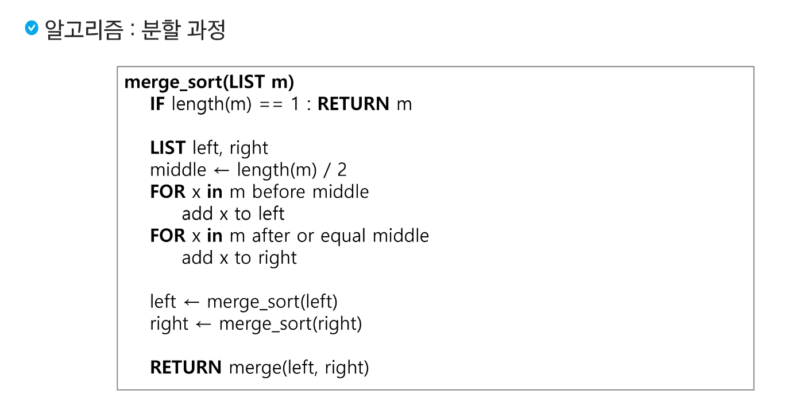
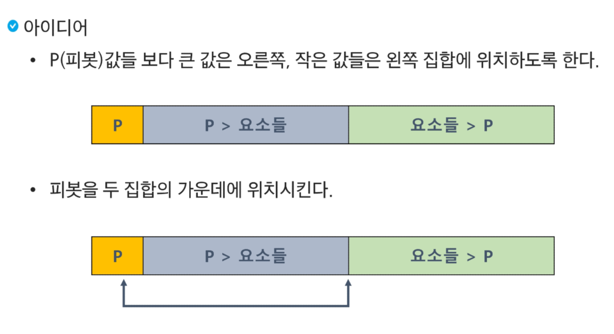

# 분할정복과 백트래킹

## 알고리즘 설계 기법의 종류 
1. 브루트포스 알고리즘 (완전탐색)
    - 배열 : for, while
    - 그래프 : bfs, dfs

-- 완전 탐색을 구현하면 시간 or 메모리초과가 될 때 --
2. 상황마다 좋은 것을 고르자 (Greedy - 그리디)
    - 규칙 + 증명 > 구현 
3. 큰 문제를 작은 문제로 나누어 부분적으로 해결하자 (Dynamic Programming)
    - 분할 정복과 다르게 작은 문제가 중복
    - 중복된 문제의 해답을 저장해놓고 재활용하자! (Memoization)
4. 큰 문제를 작은 문제로 나누어 부분적으로 해결하자 (분할정복)
5. 전체 중 가능성 없는 것을 빼자 (Backtracking - 백트래킹)

-> 이 기본들을 기반으로 더 고급 알고리즘이 개발된다. 

## 분할정복 

## 병합 정렬 
- 여러개의 정렬된 자료의 집합을 병합하여 한개의 정렬된 집합으로 만드는 방식 
- 분할정복 알고리즘 활용
    - 자료를 최소 단위의 문제 까지 나눈 후에 차례대로 정렬하여 최종 결과를 얻어냄.
    - top-down 방식
- 시간복잡도 
    - O(nlogn)
- 멀티코어 CPU나 다수의 프로세서에서 정렬 알고리즘을 병렬화 하기 위해 병합 정렬 알고리즘이 활용된다. 
- 퀵 정렬은 매우 큰 입력 데이터에 대해서 좋은 성능을 보이는 알고리즘이다. 

## 퀵 정렬
- 주어진 배열을 두개로 분할하고 각각을 정렬한다. 
- 병합정렬과 다른점 
    - 병합 정렬은 그냥 두 부분으로 나누는 반면에, 퀵 정렬은 분할할 때 기준아이템 중심으로 분할한다. 
    - 기준보다 작은것은 왼편, 큰 것은 오른편에 위치시킨다
    - 각 부분 정렬이 끝난 후 병합정렬은 병합이란 후처리 작업이 필요하나 퀵 정렬은 필요로 하지 않는다. 

sort()함수는 [Tim Sort](https://d2.naver.com/helloworld/0315536)를 사용한다

## 이진 검색 

