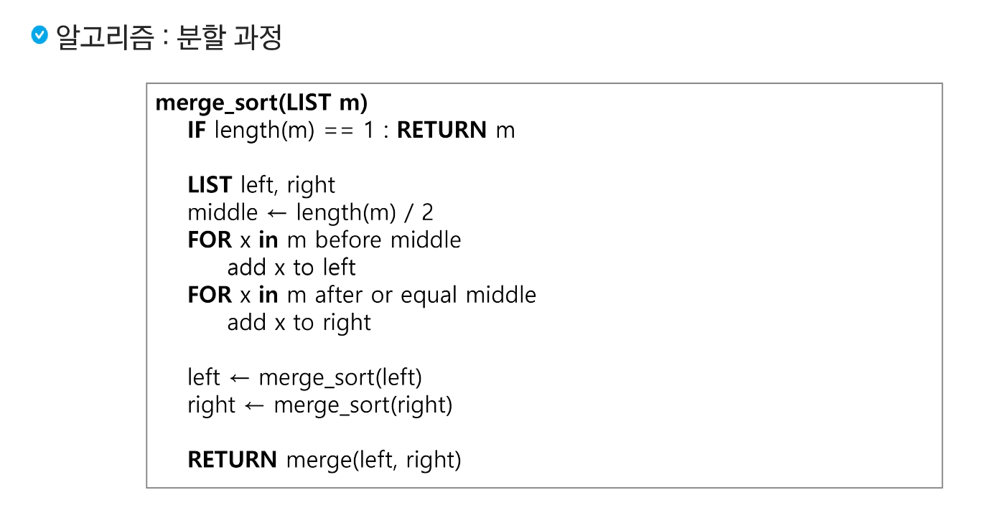
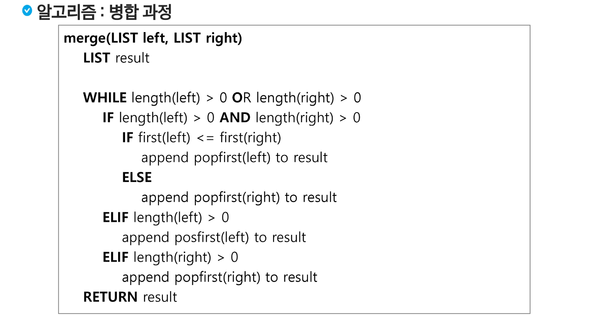
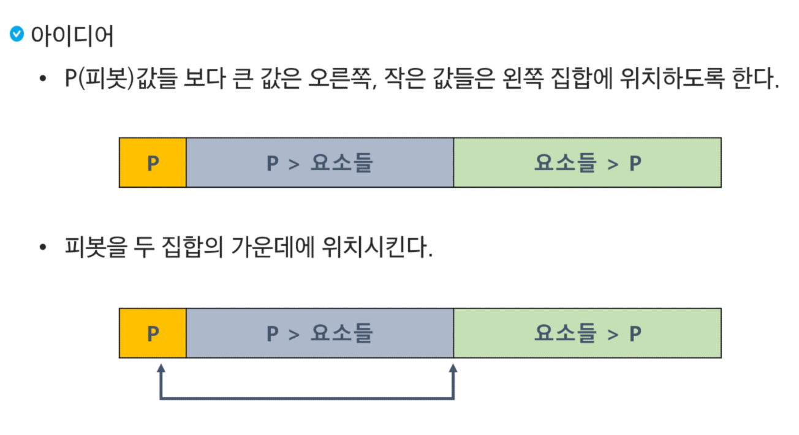

# 분할정복과 백트래킹

## 알고리즘 설계 기법의 종류 
1. 브루트포스 알고리즘 (완전탐색)
    - 배열 : for, while
    - 그래프 : bfs, dfs

-- 완전 탐색을 구현하면 시간 or 메모리초과가 될 때 --
2. 상황마다 좋은 것을 고르자 (Greedy - 그리디)
    - 규칙 + 증명 > 구현 
3. 큰 문제를 작은 문제로 나누어 부분적으로 해결하자 (Dynamic Programming)
    - 분할 정복과 다르게 작은 문제가 중복
    - 중복된 문제의 해답을 저장해놓고 재활용하자! (Memoization)
4. 큰 문제를 작은 문제로 나누어 부분적으로 해결하자 (분할정복)
5. 전체 중 가능성 없는 것을 빼자 (Backtracking - 백트래킹)

-> 이 기본들을 기반으로 더 고급 알고리즘이 개발된다. 


## 분할정복 

```python
def subset(n):
    min_value = float('inf')
    for i in range(2 ** n):
        result = 0
        for j in range(n):
            if i & (1 << j):
                result += lst[j]
                if B <= result:
                    break
        if B <= result:
            min_value = min(min_value, result - B)
            if min_value == 0:
                return 0
    return min_value


T = int(input())
for t in range(1, T+1):
    N, B = map(int, input().split())
    lst = list(map(int, input().split()))
    print(f"#{t} {subset(N)}")
```


## 병합 정렬 
- 여러개의 정렬된 자료의 집합을 병합하여 한개의 정렬된 집합으로 만드는 방식 
- 분할정복 알고리즘 활용
    - 자료를 최소 단위의 문제 까지 나눈 후에 차례대로 정렬하여 최종 결과를 얻어냄.
    - top-down 방식
- 시간복잡도 
    - O(nlogn)
- 멀티코어 CPU나 다수의 프로세서에서 정렬 알고리즘을 병렬화 하기 위해 병합 정렬 알고리즘이 활용된다. 
- 퀵 정렬은 매우 큰 입력 데이터에 대해서 좋은 성능을 보이는 알고리즘이다. 




```python
import sys
sys.stdin = open('input.txt')


def merge(left, right):
    i, j = 0, 0
    sorted_list = []

    while i < len(left) and j < len(right):
        if left[i] < right[j]:
            sorted_list.append(left[i])
            i += 1
        else:
            sorted_list.append(right[j])
            j += 1
    while i < len(left):
        sorted_list.append(left[i])
        i += 1
    while j < len(right):
        sorted_list.append(right[j])
        j += 1
    return sorted_list

def merge_sort(arr):
    global case
    if len(arr) == 1:
        return arr

    mid = len(arr) // 2
    left = arr[:mid]
    right = arr[mid:]
    left_ = merge_sort(left)
    right_ = merge_sort(right)
    if left_[-1] > right_[-1]:
        case += 1
    return merge(left_, right_)

test_case = int(input())
for T in range(1, test_case+1):
    n = int(input())
    arr = list(map(int, input().split()))
    case = 0
    arr = merge_sort(arr)
    print(f'#{T} {arr[n//2]} {case}')
```


## 퀵 정렬
- 주어진 배열을 두개로 분할하고 각각을 정렬한다. 
- 병합정렬과 다른점 
    - 병합 정렬은 그냥 두 부분으로 나누는 반면에, 퀵 정렬은 분할할 때 기준아이템 중심으로 분할한다. 
    - 기준보다 작은것은 왼편, 큰 것은 오른편에 위치시킨다
    - 각 부분 정렬이 끝난 후 병합정렬은 병합이란 후처리 작업이 필요하나 퀵 정렬은 필요로 하지 않는다. 

sort()함수는 [Tim Sort](https://d2.naver.com/helloworld/0315536)를 사용한다




```python
def partition(arr, l, r):
    p = arr[l]
    i, j = l, r
    while i <= j:
        while i <= j and arr[i] <= p:
            i += 1
        while i <= j and arr[j] >= p:
            j -= 1
        if i < j:
            arr[i], arr[j] = arr[j], arr[i]
    arr[l], arr[j] = arr[j], arr[l]
    return j


def quick_sort(arr, l, r):
    if l < r:
        s = partition(arr, l, r)
        quick_sort(arr, l, s-1)
        quick_sort(arr, s+1, r)
    return arr

test_case = int(input())
for T in range(1, test_case+1):
    n = int(input())
    arr = quick_sort(list(map(int, input().split())), 0, n - 1)
    print(f'#{T} {arr[n//2]}')
```


## 이진 검색 

```python
def binary_search(l, r, direction):
    if r < l:
        return False
    m = (l + r) // 2
    if target == lst1[m]:
        return True
    if lst1[m] < target:
        if direction == 'right':
            return False
        return binary_search(m+1, r, 'right')
    if direction == 'left':
        return False
    return binary_search(l, m-1, 'left')


T = int(input())
for t in range(1, T+1):
    N, M = map(int, input().split())
    lst1 = list(map(int, input().split()))
    lst1.sort()
    lst2 = list(map(int, input().split()))
    result = 0
    for target in lst2:
        if binary_search(0, N-1, None):
            result += 1
    print(f"#{t} {result}")
```