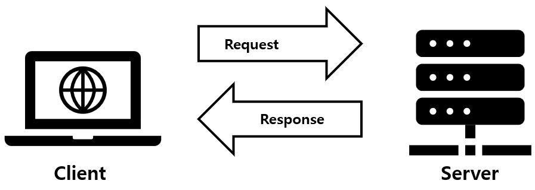
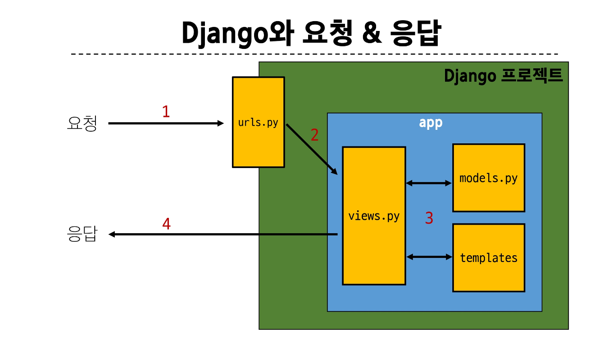

# Django

## Web Application (web service)
- 인터넷을 통해 사용자에게 제공되는 소프트웨어 프로그램을 구축하는 과정 
- 다양한 디바이스에서 웹 브라우저를 통해 접근 
- 클라이언트-서버 구조

### Server
- 서버란 클라이언트의 요청에 응답하는 주체이다. 

### 웹개발에서의 Frontend와 Backend
- Frontend
    - 사용자 인터페이스를 구성하고, 사용자가 애플리케이션과 상호작용할 수 있도록 함
    - HTML, CSS, JavaScript, 프론트엔드 프레임워크

- Backend
    - 서버 측에서 동작하며, 클라이언트의 요청에 대한 처리와 데이터베이스와의 상호작용등을 담당
    - 서버언어 및 백엔드 프레임워크, 데이터베이스, API, 보안 

## FrameWork

### 웹 서비스개발에 필요한 것 
- 로그인, 로그아웃, 회원관리, 데이터베이스, 보안 등 너무 많은 기술들이 필요
- 하나부터 열까지 개발자가 모두 작성하는 것은 현실적으로 어려움 
- 하지만 모든걸 직접 만들 필요가 없음 
- 잘 만들어진 것들을 가져와 좋은 환경에서 내것으로 잘 사용하는 것도 능력인 시대. 

### Django
- Python기반의 대표적인 웹 프레임워크 
- 왜 장고를 사용할까?
    - 다양성 : Python기반으로 소셜미디어 및 빅데이터 관리등 광범위한 서비스 개발에 적합하다
    - 확장성 : 대량의 데이터에 대해 빠르고 유연하게 확장할 수 있는 기능을 제공한다
    - 보안 : 취약점으로부터 보호하는 보안 기능이 기본적으로 내장되어 있다
    - 커뮤니티 지원 : 개발자를 위한 지원, 문서 및 업데이트를 제공하는 활성화 된 커뮤니티. 

### 가상환경
python 애플리케이션과 그에따른 패키지들을 격리하여 관리할 수 있는 독립적인 실행환경

### 가상환경생성 
가상환경 venv를 만든다. (가상환경을 만들겠다, 가상환경의 이름) : 

`python -m venv venv`

가상환경을 활성화 시킨다 :

`source venv/Sripts/activate`
환경에 설치된 패키지 목록을 확인 :
`pip list`

### 패키지 목록이 필요한 이유 
프로젝트를 진행을 할 때 필요함
의존성 패키지 목록 생성 

`pip freeze > requirements.txt`

venv와 requirements로 이름 고정해야한다. 

### 의존성 패키지 관리의 중요성 
- 개발 환경에서는 각각의 프로젝트가 사용하는 패키지와 그 버전을 정확히 관리하는 것이 중요하다 
 
## django project
프로젝트를 시작한다

`django-admin startproject firstpjt .`

서버를 실행한다

`python manage.py runserver`

### Django 프로젝트 생성 루틴 정리 + git
1. 가상환경 생성
2. 가상환경 활성화 
3. Django 설치
4. 의존성 파일 생성 (패키지 설치시마다 진행)
5. .gitignore 파일 생성 (첫 add 전)
6. git 저장소 생성
7. Django 프로젝트 생성 

### LTS (Long-Term Support)
- 이게 메인입니다! 라고 알려주는 버전임
- 장기간 지원되는 안정적인 버전을 의미할 때 사용한다. 
- 기업이나 대규모 프로젝트에서는 소프트웨어 업그레이드에 많은 비용과 시간이 필요하기 때문에 안정적이고 장기간 지원되는 버전이 필요하다. 

## 디자인 패턴 
> 애플리케이션의 구조는 이렇게 구성하자!

소프트웨어 설계에서 발생하는 문제를 해결하기 위한 일반적인 해결책 (공통적인 문제를 해결하는데 쓰이는 형식화된 관행)
 
### MVC 디자인 패턴 
애플리케이션을 구조화하는 대표적인 패턴 
(Model, View, Controller)

### MTV 디자인 패턴 
이름만 바꾸고 MVC랑 똑같음
Django에서 애플리케이션을 구조화하는 패턴 
기존 MVC 패턴과 동일하나 단순히 명칭을 다르게 정의한 것
(view -> template, controller -> view로 바꾼 것 뿐.)

### 프로젝트와 앱
- 큰 프로젝트 안에 여러개의 앱이 들어가게 된다.
1. 앱 생성 

`python manage.py startapp articles`

2. 앱 등록 
반드시 앱을 생성한 후에 등록해야함 

* MTV에서 T가 만들어져있지 않음 

### 요청과 응답

views.py에서 많은 비즈니스가 이루어진다. 

## 걀론
1. .gitignore 파일 추가
2. 가상환경 설치
3. 가상환경 실행
4. pip install django
5. 

## ERRORS
articlesdjango
: urls.py에 'articles'를 추가하지 않음
