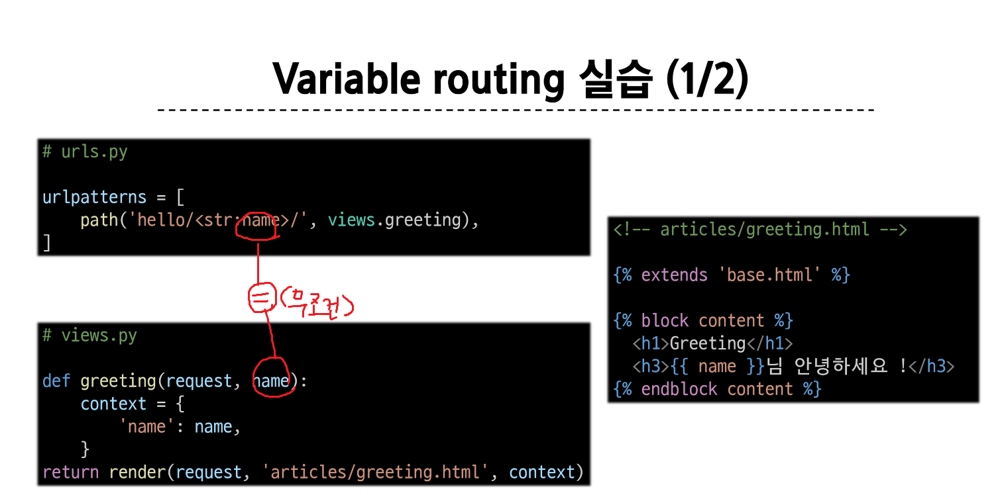

# Templates & URLs

## Template System
데이터로 표현을 제어하면서, 표현과 관련된 부분을 담당한다. 

데이터를 전달하고싶다 
-> render의 3번째 인자에 dictionary형태의 데이터로 전달을 해주면 된다. 

### Django Template Language (DTL)
1. variable 
- render 함수의 세번째 인자로 딕셔너리 데이터를 사용
- 딕셔너리 key에 해당하는 문자열이 template에서 사용가능한 변수명이 됨
- dot('.')을 사용하여 변수 속성에 접근할 수 있음 
- `{{variable}}` or `{{variable.attribute}}`
- arr[0]으로 검색하면 못찾고 arr.0으로 접근해야 검색이 가능하다.

2. Filters
- 표시한 변수를 수정할 때 (변수 + '|' + 필터)
- 띄어쓰기 하면 안됨. 
- chained이 가능하며 일부 필터는 인자를 받는다.
- 약 60개의 built-in template filters를 제공한다. 

3. Tags
- 반복 또는 논리를 수행하여 제어 흐름을 만든다. 
- 일부 태그는 시작과 종료 태그가 필요하다. 
- 약 24개의 built-in template tags를 제공한다.
- `` or ` `
- ` ` 등등 기억하기

4. Comments
- DTL에서의 주석 
- 시작태그와 종료 태그 안에 주석처리를 할 때 사용한다 
- `{# name #}`인데 보통 `  어쩌구저쩌구주석처리할곳   `를 쓴다.
- html주석을 쓰면 에러가 날 수 있다. 

### 템플릿 상속
- 만약 모든 템플릿에 bootstrap을 적용하려면 ?
- 페이지의 공통 요소를 포함하고
- 하위 템플릿이 재정의 할 수 있는 공간을 정의하는 기본 'skeleton'템플릿을 작성하여 상속 구조를 구축한다. 
- blick tag : 하위 템플릿에서 재정의 할 수 있는 블록을 정의한다. 
- extends tag : 자식 템플릿이 부모 템플릿을 확장한다는 것을 알림. 반드시 자식 템플릿 최상단에 작성되어야 한다. 

### BASE_DIR
setting.py에 BASE_DIR이 있다. manage.py의 부모폴도를 의미한다. app폴더 외부에서도 html파일을 찾을 수 있도록 설정을 하는 것이다. TEMPLATES의 'dirs'에 [BASE_DIR / 'templates']를 작성해주면 된다. 

## HTML form 
- 사용자로부터 할당된 데이터를 서버로 전송하는 것 
- 웹에서 입력하는 것들 
- input 값들을 모아서 서버로 보낸다

### form 태그 
form element 
- 사용자로부터 할당된 데이터를 서버로 전송한다 
- 웹에서 사용자 정보를 입력하는 여러 방식을 제공한다. 

### action과 method
#### action 
- 입력 데이터가 전송될 URL을 지정 == **서버주소** (목적지)
- 만약 비워둔다면 현재 주소로 데이터를 전송한다. 
- 만약 이 속성을 지정하지 않으면 데이터는 현재 form이 있는 페이지의 url로 보내짐

#### method
- 데이터를 어떤 방식으로 보낼 것인지 정의
- 데이터의 HTTP request methods (Get(엽서), Post(편지))를 지정
- 로그인 할 때 get방식으로 하면 url에 아이디가 나오게 된다. 하지만 post는 로그인 할 때 아이디가 url에 노출되지 않는다. 

### name
네임 속성이 없으면 서버에 옮겨줄 데이터 덩어리가 없어진다. 

### Query string parameters
[url](https://developer.mozilla.org/ko/docs/Learn/Common_questions/Web_mechanics/What_is_a_URL)
- 사용자의 입력 데이터를 URL주소에 파라미터를 통해 서버로 보내는 방법 
- 문자열은 앰퍼센드('&') 로 연결된 key=value 쌍으로 구성되며, 기본 URL과는 '?'로 구분된다. 

### form 활용
- request.GET.get('message')

## Django URLs

### variable routing작성법 
<str:>일때는 생략 가능 
<int:>일때는 명시해주어야 한다. 

