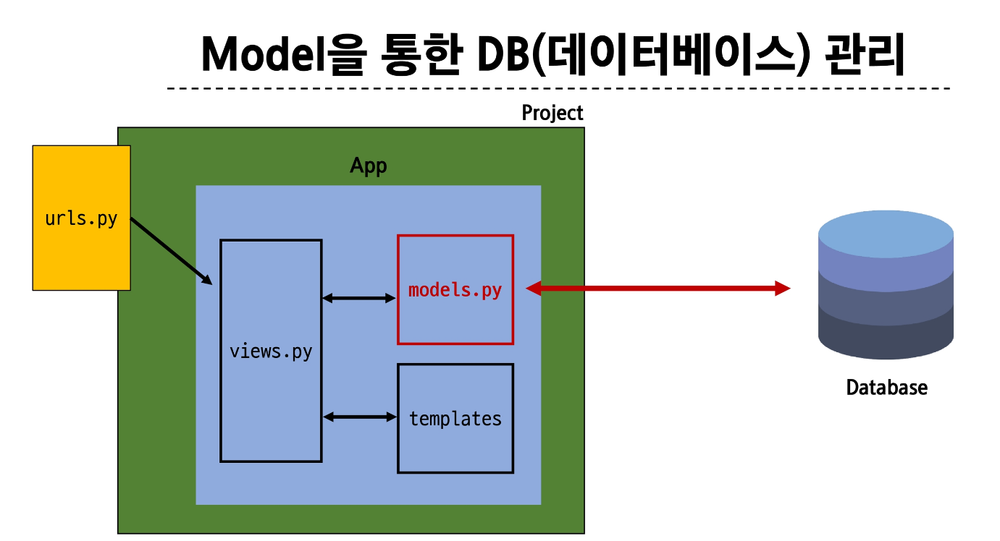
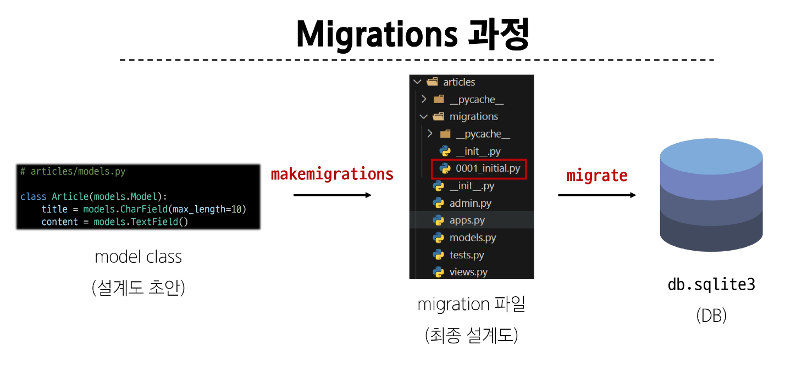
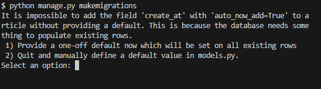

# MODEL

## app 과 url
URL dispatcher
- url 패턴을 정의하고 해당 패턴이 일치하는 요청을 처리할 view 함수를 연결 
- url은 사용자의 주소이다. 처리를 가능한지 여부를 확인하고 연결해준다 

### APP URL mapping 
- page가 늘어날수록 url도 늘어나기 때문에 각자 app에서 움직일 수 있도록 한다. 
- url의 기존 파일을 프로젝트파일, app파일에 하나씩 만들어둔다. 
- 1차 처리는 project파일에서, 나머지 처리는 app 파일에서 정리한다. 

### include()
프로젝트 내부 app들의 URL을 참조할 수 있도록 매핑하는 함수 
- URL의 일치하는 부분까지 잘라내고, 남은 문자열 부분은 후속처리를 위해 include된 url로 전달
- urls.py에 path('주소', include('주소.urls'))


```python 
from django.urls import path
from . import views


app_name = ''
urlpatterns = [

]
```


### URL구조 변경에 따른 문제점
- 기존 articles/주소가 articles/index/로 변경됨에 따라 해당 주소를 사용하는 모든 위치를 찾아가 변경해야한다. 
- URL에 이름을 지정하는 것 -> Naming URL patterns. 

이름 앞에 앱 이름을 태그로 사용해서 붙여준다. 

app_name속성 지정


Function views
    1. Add an import:  from my_app import views
    2. Add a URL to urlpatterns:  path('', views.home, name='home')
Class-based views
    1. Add an import:  from other_app.views import Home
    2. Add a URL to urlpatterns:  path('', Home.as_view(), name='home')
Including another URLconf
    1. Import the include() function: from django.urls import include, path
    2. Add a URL to urlpatterns:  path('blog/', include('blog.urls'))


## Model 


DB의 테이블을 정의하고 데이터를 조작할 수 있는 기능들을 제공한다. 
테이블 구조를 설계하는 청사진과 같다. 

```python
# articles/models.py
from django.db import models

class Article(models.Model): 
    title = models.CharField(max_length=10)
    content = models.TextField()

```
model모듈의 Model 클래스를 상속받는다
개발자는 가장 중요한 테이블 구조를 어떻게 설계할지에 대한 코드만 작성하도록 하기 위한 것이다. 

modelField클래스
- 데이터 필드의 제약조건 관련 설정한다.
- 필드 이름/ 필드 데이터 타입/ 필드의 제약조건


## Migration 
model클래스의 변경사항을 DB에 최종 반영하는 방법 


`python manage.py makemigrations`
`python manage.py migrate`
최종 테이블 이름은 "앱이름_모델클래스이름"으로 저장된다. 


### 이미 생성된 테이블에 필드를 추가해야 한다면?
models.py를 수정 하고 makemigrations로 넘기면

빈 컬럼을 추가하려고 해서 무결성의 원칙에 위배되는 상황이기 때문에 문제가 생긴다. 

## model Field
DB테이블의 필드(열)을 정의하며, 해당 필드에ㅔ 저장되는 데이터 타입과 제약조건을 정의한다. 

CharField()
- 제약조건이 반드시 필요하다. 길이의 제한이 있을때. 
TextField()
- 똑같은 문자열 필드이지만 제약을 주지 않을 때 사용한다. 
DateTimeField()
- 날짜와 시간을 넣을 때 사용
- auto_now
    - 데이터가 저장될 때마다 자동으로 현재 날짜시간을 저장한다.
- auto_now_add
    - 데이터가 처음 생성될 때만 자동으로 현재 날짜시간을 저장한다. 


## Admin Site
`python manage.py createsuperuser`
관리자 계정을 생성하겠다
