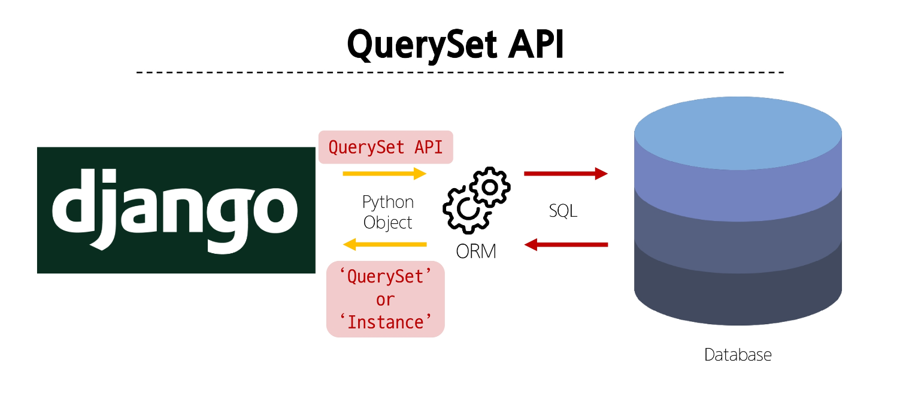

# ORM 

Before start....
```
python -m venv venv
source venv/Scripts/activate
pip install -r requirements.txt
```

## ORM
Object-Relational-Mapping

객체 지향 프로그래밍 언어를 사용하여 호환되지 않는 유형의 시스템 간에 데이터를 변환하는 기술 
(한쪽에서는 Python, 다른쪽에선 다른언어로 말하면 이해할 수 없음 => 번역을해주는 것)

목표 : database를 다루기 위해 

### QuerySet API
ORM에서 데이터를 검색,필터링, 정렬 및 그룹화 하는 데 사용하는 도구 
- API를 사용하여 SQL아니어도 Python으로 처리가 가능함. 

- model class/Manager/QuerysetAPI 형태의 구문이다. 
- ex : Article.objects.all() : article의모든 object를검색한다. 

### Query 
- 데이터 베이스에 특정한 데이터를 보여 달라는 요청 
- 쿼리문을 작성한다. 
    -> 원하는 데이터를 얻기 위해 데이터베이스에 요청을 보낼 코드를 작성한다. 
- 파이썬으로 작성한 코드가 ORM에 의해 SQL로 변환되어 데이터베이스에 전달되며, 데이터베이스의 응답 데이터를 ORM이 QuerySet이라는 자료 형태로 변환하여 우리에게 전달한다. 

### QuerySet
- 데이터베이스에게서 전달 받은 객체 목록(데이터모음)
    -> 순회가 가능한 데이터. 한 개 이상의 데이터를 불러와 사용할 수 있다. 
- Django ORM을 통해 만들어진 자료형 
- 데이터 베이스가 단일한 객체를 반환 할 때는 QuerySet이 아닌 모델(Class) 의 인스턴스로 반환된다 

### QuerySet API
- Python의 모델 클래스와 인스턴스를 활용해 DB에 데이터를 저장, 조회, 수정, 삭제하는 것 (CRUD)


## QuerySet API 실습 

1. ipython, django-extensions 설치 
```shell
# shell 환경을 조금 더 편하게 사용할 수 있다. 
pip install ipython 
pip install django-extensions
```
2. settings에 installed apps에추가 
```python
Installed_APPS = [
    'articles',
    'django_extensions',
    ...
]
```

3. 설치한 라이브러리 requirements에 업데이트 
`pip freeze > requirements`


### Django shell
- Django 환경 안에서 실행되는 python shell
(입력하는 QuerySet API 구문이 Django 프로젝트에 영향을 미침)
- `python manage.py shell_plus`
- 나갈땐 `exit()`

`Article.objects.all()` 줬더니 대괄호로 감싸진 
<QuerySet [<Article: Article object (1)>]>를 반환한다. 

`article.created_at`를 하면 datetime.datetime(2024, 3, 25, 5, 39, 32, 344539, tzinfo=datetime.timezone.utc) 를 반환한다. 생성 시간을 반환한다. 

`article.pk` : primary key (id랑 비슷함) 


## CREATE


```python
# 1. 새로운 행을 추가하여 만든다. 
article = Article()
article.title
article.content
article.created_at

# 2. article save를 호출하여 확인
article = Article(title='second', content = 'django!')
article.save()
# 확인
Article.objects.all()

# 3. create 메서드를 사용한다.
Article.objects.create(title='third',content='django!')
```

## READ
- all

- filter
    - article__lte : less than equal 
    - lookup 함수를 잘 찾아볼것 
    
- get
    - 유일한! 데이터를 찾을 때 get을 사용한다. 
    - 그래서 주로 pk를 이용해서 조회한다. 
    - 둘 이상의 객체를 찾으면 MultipleObjectsReturned라는 예외가 나온다.
    - 객체를 찾을 수 없으면 DoesNotExist 라는 예외가 나온다. 


## UPDATE
순서
1) 바꿀 데이터를 조회하고 
2) 데이터를 업데이트 하고 
3) article.save()


## DELETE

- 이미 지워진 pk값은 다시 사용하지 않는다. 

## 참고 

### field lookups
- 특정 레코드에 대한 조건을 설정하는 방법 
- QuerySet 메서드 filter(), exclude() 및 get()에 대한 키워드 인자로 지정. 
- `Article.objects.filter(content__contains='dja')`

[querySet Official Docs](https://docs.djangoproject.com/en/5.0/ref/models/querysets/)

[Making Queries](https://docs.djangoproject.com/en/5.0/topics/db/queries/)


**작성한 쿼리는 이제 migrations > views.py에서 작성하면 된다**
urls -> view -> templates 순서대로 작성한다 (데이터의 흐름)
