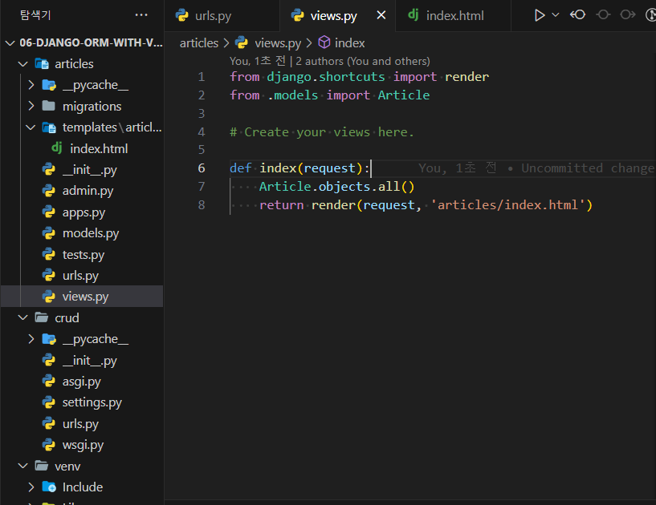
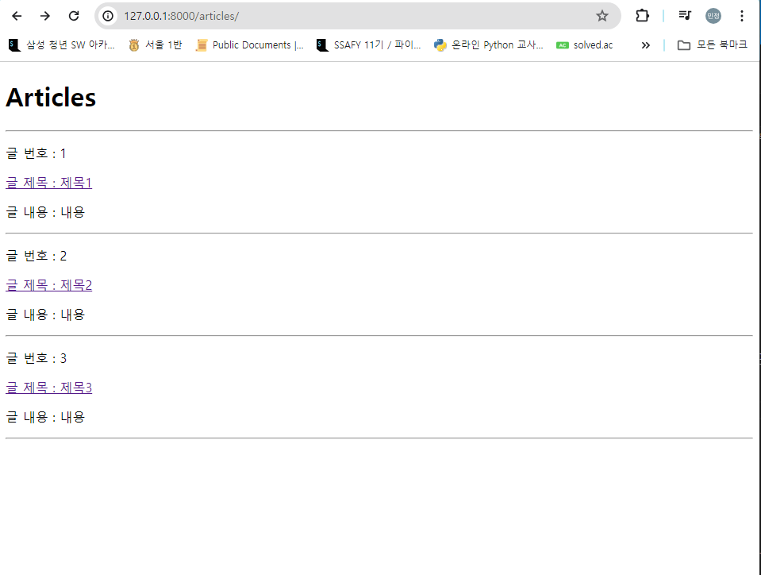
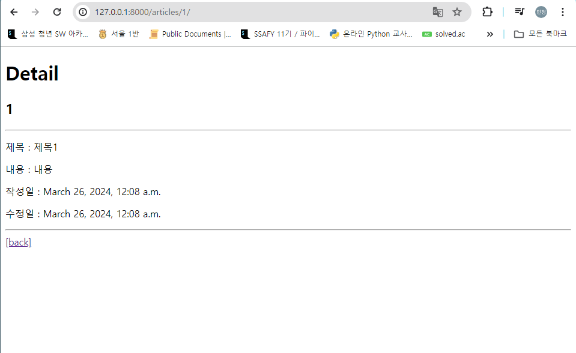

# ORM with View

## READ
2가지 read(조회) 진행
1. 전체 게시글 조회
2. 단일 게시글 조회





[variable routing](https://docs.djangoproject.com/en/5.0/topics/http/urls/)




>>articles/urls.py
```python
from django.urls import path
from . import views

app_name = 'articles'
urlpatterns = [
    path('', views.index, name= 'index'),
    path('<int:pk>/', views.detail, name='detail'), 
]

```


>> articles/views.py
```python
from django.shortcuts import render
from .models import Article

# Create your views here.

def index(request):
    articles = Article.objects.all()
    context = {
        'articles': articles,
    }
    return render(request, 'articles/index.html', context)

def detail(request, pk):
    article = Article.objects.get(pk=pk)
    context = {
        'article' : article,
    }
    return render(request, 'articles/detail.html', context)
```

>> templates/articles/detail.html
```html
<!DOCTYPE html>
<html lang="en">
<head>
  <meta charset="UTF-8">
  <meta name="viewport" content="width=device-width, initial-scale=1.0">
  <title>Document</title>
</head>
<body>
  <h1>Detail</h1>
  <h2>{{ article.pk }}</h2>
  <hr>
  <p>제목 : {{ article.title }}</p>
  <p>내용 : {{ article.content }}</p>
  <p>작성일 : {{ article.created_at }}</p>
  <p>수정일 : {{ article.updated_at }}</p>
  <hr>
  <a href="">[back]</a>
</body>
</html>

```

>> templates/articles/index.html
```html
<!DOCTYPE html>
<html lang="en">
<head>
  <meta charset="UTF-8">
  <meta name="viewport" content="width=device-width, initial-scale=1.0">
  <title>Document</title>
</head>
<body>
  <h1>Articles</h1>
  <hr>
  
    <p>글 번호 : {{ article.pk }}</p>
    <a href=" ">
        <!--article.pk없으면 no reversed match 에러가 난다  -->
      <p>글 제목 : {{ article.title }}</p>
    </a>
    <p>글 내용 : {{ article.content }}</p>
    <hr>
  
</body>
</html>
```

- 개별 데이터를 조회할 때에는 반드시 pk를 잊지 말자!

## Create 
- Throw 와 Catch 흐름을 알고 있어야 한다.
create 로직을 구현하기 위해 필요한 view 함수의 개수는 
1. 사용자 입력 데이터를 받을 페이지를 렌더링하는 new함수
2. 사용자가 입력한 데이터를 받아 DB에 저장하는 create함수 
두개가 필요하지만 내일 수업에서 1개로 합쳐지는 함수를 배울 것임. 

### 실습. new기는 구현 (create 하는 form)


## GET Method
- 특정 리소스를 **조회**하는 요청
- 조회할 때만 get이고 나머지는 post로 한다 
- form 버튼은 submit 버튼이 필수이고 csrf_token은 submit이 필수이다


### redirect
`return redirect('articles:detail')`
redirect는 Get으로 요청이 들어가는 것. 


## HTTP request methods

