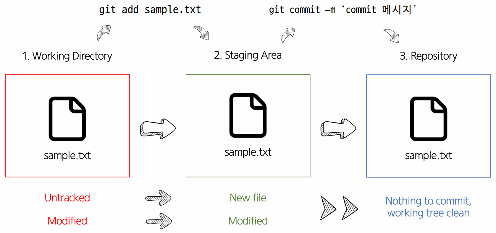

# Git이란 
* git은 분산버전 관리 시스템이다. 

# Git 은 3개의 영역. 
1. Working Directory
    * 현재 작업중인 영역
2. Staging Area
    * 버전 관리를 위한 파일, 폴더를 선별하기 위한 공간
3. Repository
    * 버전이 저장되는 공간

# Git 기본 명령어 정리
* `git init` : git 관리 영역으로의 선언
    * 주의사항 : 이미 git으로 관리되는 영역 내부 폴더에서 다시 `git init`을 하지 말자! (submodule에 대한 명령으로 응용등급이니 나중에 확인하자)
* `git add 파일명 _or_경로` : WD에서 작업한 파일이나 폴더를 SA로 전달하는 명령어. 전달의 이유는 commit을 찍기 위해서이다. (버전ㅇ르 생성하기 위해)
* `git commit -m '커밋메세지'` : 실제 버전을 생성하는 명령어 (커밋메세지는 의미있는 내용으로 작성하기!)
* `git status` : 현재 git의 상태를 확인할 수 있는 명령어
    * untracked : 아직 관리된 적 없는 파일
    * modified : 관리되고 있는 파일이 수정된 경우 
    * 붉은색 : WD에서 파일이 변경 되거나 생성된 경우 
    * 녹색 : SA에 위치한 파일인 경우
* `git log` : 현재 저장된 commit 히스토리를 알 수 있다
    * `--oneline` : 해당 옵션은 commit 정보를 한 줄로 보여주는 옵션이다.
* `git config --global -l`: 현재 git 설정 정보를 알 수 있다. (global)

