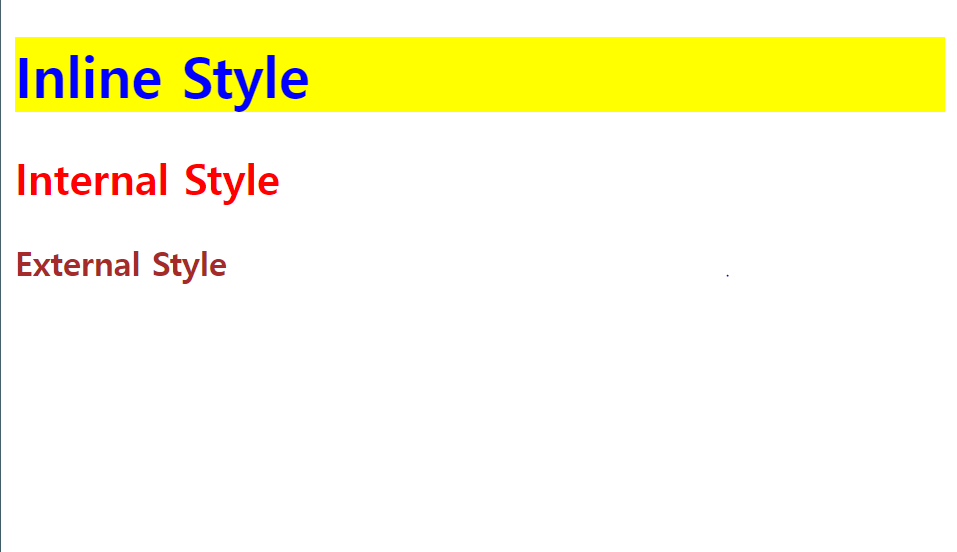
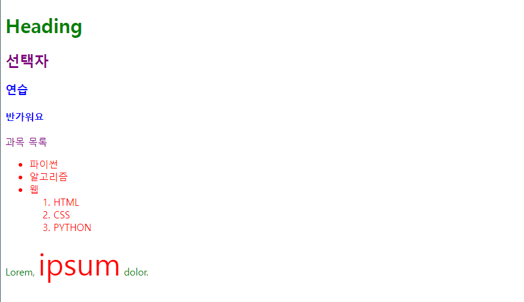

# CSS
Date : 24-03-06
j
### css
- 웹 페이지의 디자인과 레이아웃을 구성하는 언어 

### css구문 
```css
h1 {
    color: red;
    font-sie : 30;
}
```
- h1 : 선택자. 스타일을 선택할 수 있게 열어준다
- color : 글자 색을 설정해줌
- background-color : 배경 색 설정해줌
- rem: 기본 사이즈의 배수 크기로 설정해줌(k rem = 16*k px)
- root(16px) : 기본 사이즈를 설정해줌 
- h1안의 각각이 선언을 해주는 코드이다
- 속성:값; 형태로 선언이 이루어진다. 
- ; : 선언이 끝났음을 의미한다. 


## web styling

1. 인라인 스타일 
    - 오프닝 태그 내부에다가 속성을 입력하는 것이다. 
    - stype = "~~~~" , 스타일 속성 값으로 작성한다.

2. 내부 스타일 시트 
    - 헤드 내부안에 스타일 태그를 달아준다 
    ```html <!DOCTYPE html>
        <html lang="en">

        <head>
        <meta charset="UTF-8">
        <meta name="viewport" content="width=device-width, initial-scale=1.0">
        <title>Document</title>
        <style>
            h2{
            color: red;
            }
        </style>
        <link rel="stylesheet" href="style.css">
        </head>```

3. 외부 스타일 시트 
    - .css로 된 파일을 사용하는 것 


## 실습2 
```html
<!DOCTYPE html>
<html lang="en">

<head>
  <meta charset="UTF-8">
  <meta name="viewport" content="width=device-width, initial-scale=1.0">
  <title>Document</title>
  <style>
    h2{
      color: red;
    }
  </style>
  <link rel="stylesheet" href="style.css">
</head>

<body>
  <h1 style = 'color: blue; background-color : yellow;'>Inline Style</h1>
  <h2>Internal Style</h2>
  <h3>External Style</h3>
</body>

</html>

```



- 3번 방법이 재사용성이 좋고 유지보수가 좋아서 일반적으로 외부 스타일시트를 사용한다. 
- 하지만 앞으로 실습할 때는 2번 방법 내부 스타일 시트를 사용할 것이다. 


### CSS Selectors
- html요소를 선택하여 스타일을 적용할 수 있도록 하는 선택자
- 지금까지 썼던 방법은 태그 하나를 선택하는 방법이다. 만약 중복되는 태그이름이 있다면 특정 하나 태그를 변경하는 것이 어려워진다. 

### CSS Selectors 종류
- 기본선택자 
    * 전체("*") 선택자 
        - a모든 요소를 선택한다
    * 요소(tag) 선택자
        - tag를 선택해온다
    * 클래스(class'.') 선택자
        - class의 속성을 선택한다 
    * 아이디(id'#') 선택자
        - id속성을 선택한다
    * 속성(attr) 선택자 
        - [속성 = 값] 형태로 
        - 속성 값을 선택한다

- 결합자 
    * 자손 결합자(" ")
        - 자식과 손주 포함
    * 자식결합자 (">")
        - ONLY 자식만


## 실습3


```html
<!DOCTYPE html>
<html lang="en">

<head>
  <meta charset="UTF-8">
  <meta http-equiv="X-UA-Compatible" content="IE=edge">
  <meta name="viewport" content="width=device-width, initial-scale=1.0">
  <title>Document</title>
  <style>
    * {
      color: red;
    }
    h2{
      color: orange;
    }
    h3, 
    h4 {
      color: blue;
    }
    .green {
      color: green;
    }
    #purple{
      color: purple;
    }

    .green > span {
      font-size: 50px;
    }
  </style>
</head>

<body>
  <h1 class="green">Heading</h1>
  <h2 id="purple">선택자</h2>
  <h3>연습</h3>
  <h4>반가워요</h4>
  <p id="purple">과목 목록</p>
  <ul class = "green">
    <li>파이썬</li>
    <li>알고리즘</li>
    <li>웹
      <ol>
        <li>HTML</li>
        <li>CSS</li>
        <li>PYTHON</li>
      </ol>
    </li>
  </ul>
  <p class="green">Lorem, <span>ipsum</span> dolor.</p>
</body>

</html>

```



### Specificity (명시도)
- 결과적으로 요소에 적용할 css선언을 결정하기 위한 알고리즘 
- css selector 에 가중치를 계산하여 어떤 스타일을 적용할지 결정 


### cascading
- 계단식
- 한 요소에 동일한 가중치를 가진 선택자가 적용될 때 : 마지막에 나오는 선언이 사용됨. 
    ```html
    h1 {
        color:red ;
    }
    h1 {
        color:purple;
    }
    ```
- 이때는 purple이 된다 
- 같은 변수이므로 가장 마지막에 작성된 값이 적용이 된다. 

    ```html
    .make-red{
        color:red;
    }
    h1{
        color:purple;
    }
    ```
- red가 선택이 된다 
- .make-red가 class > 요소 선택자 이기 때문이다.

### 명시도가 높은 순 
1. importance
    - !important
    - 무조건 최우선순위로 적용한다. 
2. inline 스타일 
3. 선택자 
    - id 선택자 > class 선택자 > 요소선택자
4. 소스코드 선언순서 

!! class(.이름): 내용이 중복될 때
!! id선택자(#d이름) : 특정 부분에만 디자인하고 싶을 때 

```html

.make-red{
        color:red;
    }
    h1{
        color:purple;
    }

<h1 class = "make-red">

<div class = "make-red">
    <h1> hello<h1>
</div>
```
- 이럴 때는 purple이 나온다. 동일한 태그에 대해 같은 스타일이 적용이 된다. 


- 속성은 되도록 class만 쓸것


## CSS속성 2가지 분류 
- 상속되는 속성 
    - Text관련 요소 (font, color, text-align), opacity, visibility
    - boxmodel 관련 요소 (width, height, border, box-sizing)
- 상속되지 않는 속성
    - position 관련요소 (position, top/right/bottom/left, z-index)

