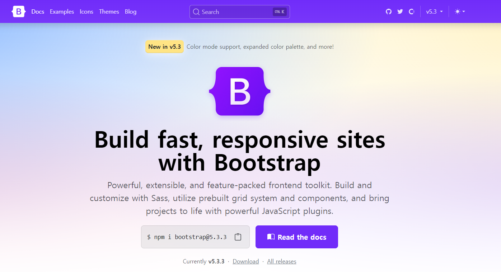
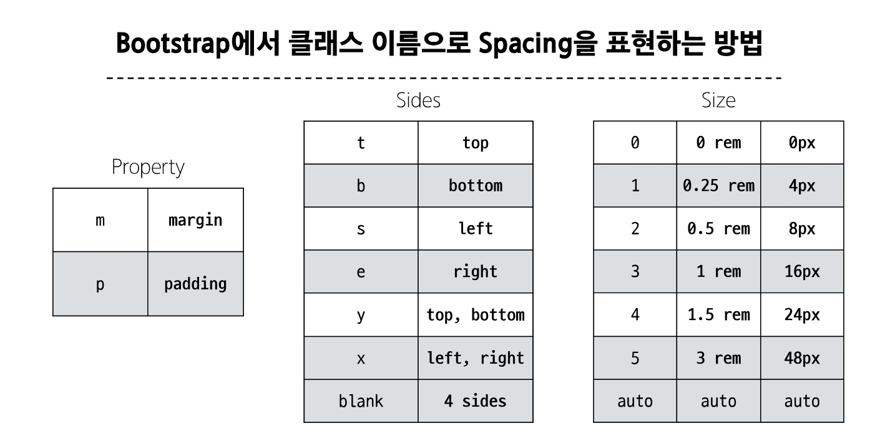

# BOOTSTRAP

지금까지 배운 내용
1. 구조와 스타일링
2. 레이아웃, 배치, 공간배분, 정렬 (position, flexbox)

-> 잘 만들어진 디자인을 가지고 와서 

## Bootstrap
- css 프론트엔드 프레임워크 
- 미리 만들어진 다양한 디자인 요소들을 제공하여 웹 사이트를 빠르고 쉽게 개발할 수 있도록 함.
- 공식문서를 잘 읽자!



> Get started by including Bootstrap’s production-ready CSS and JavaScript via CDN without the need for any build steps. See it in practice with this Bootstrap CodePen demo.


코드!
```html
<!doctype html>
<html lang="en">
  <head>
    <meta charset="utf-8">
    <meta name="viewport" content="width=device-width, initial-scale=1">
    <title>Bootstrap demo</title>
    <link href="https://cdn.jsdelivr.net/npm/bootstrap@5.3.3/dist/css/bootstrap.min.css" rel="stylesheet" integrity="sha384-QWTKZyjpPEjISv5WaRU9OFeRpok6YctnYmDr5pNlyT2bRjXh0JMhjY6hW+ALEwIH" crossorigin="anonymous">
  </head>
  <body>
    <h1>Hello, world!</h1>
    <script src="https://cdn.jsdelivr.net/npm/bootstrap@5.3.3/dist/js/bootstrap.bundle.min.js" integrity="sha384-YvpcrYf0tY3lHB60NNkmXc5s9fDVZLESaAA55NDzOxhy9GkcIdslK1eN7N6jIeHz" crossorigin="anonymous"></script>
  </body>
</html>
```
- bootstrap.min.css 를 보니 어디 온라인에 올라가 있는 파일을 가져와서 쓰는 것이군! <br>
마찬가지, bootstrap.bundle.min.js도 외부 주소를 통해 파일을 가지고 오는 형태이다. 


## CDN
- Content Delivery Network
- 지리적 제약없이 빠르고 안전하게 콘텐츠를 전송할 수 있는 전송기술
- 서버와 사용자 사이의 물리적인 거리를 줄여 콘텐츠 로딩에 소요되는 시간을 최소화한다 (웹페이지 로드 속도를 높인다)
- 지리적으로 사용자와 가까운 CDN 서버에 콘텐츠를 저장해서 사용자에게 전달

### .min. 
파일 줄을 압축시키는 방법.

### 기본사용법 
`class = "mt-5"`
- {property}{sides}-{size}
- mt-5는 margin top - 5 


## Reset CSS
- 모든 설정을 초기화 하고 일관된 기준으로 재설정하는 규칙 세트이다. 

- 모든 브라우저는 각자의 **'user agent stylesheet'**를 가지고 있다 
- 문제는 브라우저마다 이 설정이 상이하다는 것이다 
- Normalize css : reset css방법 중 대표적인 방법. 웹표준 기준으로 브라우저중 하나가 불일치 한다면 차이가 있는 브라우저를 수정하는 방법. 
- bootstrap은 bootstrap-reboot.css라는 파일명으로 normalize.css를 자체적으로 커스텀해서 사용하고 있다. 

## Bootstrap 활용
### Typography 
- 제목, 본문 텍스트, 목록
- display headings : 제목을 좀더 강조하고 싶을 때 (기존 heading보다 더)
- inline text elements:
    - del, s : 취소줄
    - ins, u : 밑줄
    - small : 글자가 좀 작아짐
    - strong : 볼드체
    - em : 이탤릭 
- list-unstyled 
    - 앞에 list임을 나타내는 점들이 다 빠짐 

### Lists 
list unstyled
```html
<ul class="list-unstyled">
  <li>This is a list.</li>
  <li>It appears completely unstyled.</li>
  <li>Structurally, it's still a list.</li>
  <li>However, this style only applies to immediate child elements.</li>
  <li>Nested lists:
    <ul>
      <li>are unaffected by this style</li>
      <li>will still show a bullet</li>
      <li>and have appropriate left margin</li>
    </ul>
  </li>
  <li>This may still come in handy in some situations.</li>
</ul>
```

### Color 
[color를 입히는법](https://getbootstrap.com/docs/5.3/utilities/colors/)


### Componenet
bootstrap에서 제공하는 UI관련 요소 
- 버튼, 네비게이션 바, 카드, 폼, 드롭다운
- 일관된 디자인을 제공하여 웹사이트의 구성요소를 구축하는데 유용하게 활용한다 


## Bootstrap을 사용하는 이유 
1. 가장 많이 사용되는 CSS 프레임워크
2. 사전에 디자인된 다양한 컴포넌트 및 기능
  - 빠른 개발과 유지보수
3. 손쉬운 반응형 웹 디자인 구현 
4. 커스터마이징이 용이하다
5. 크로스 브라우징 지원 ( 모든 주요 브라우저에서 작동하도록 설계되어있음. )

## Sematic Web 
- 웹 데이터를 의미론적으로 구조화된 형태로 표현하는 방식. 
- 글자를 크게 하는 것보다 h1태그를 이용해서 제목을 표현한다면 페이지에 의미를 제공하게 된다. 
- 검색엔진 및 개발자가 웹 페이지 콘텐츠를 이해하기 쉽도록 한다. 
- header, nav, main, article, section, aside, footer

### CSS 방법론
- CSS를 효율적이고 유지 보수가 용이하게 작성하기 위한 일련의 가이드라인. 
- OOCSS : 객체지향적 접근법을 적용하여 CSS를 구성하는 방법론 
    1. 구조와 스킨을 분리한다
    2. 컨테이너와 콘텐츠를 분리한다. 

### 의미론적인 마크업이 필요한 이유
- 검색엔진 최적화(SEO)
  - 검색엔진이 해당 웹 사이트를 분석하기 쉽게 만들어 검색 순위에 영향을 준다. 
- 웹 접근성
  - 웹 사이트, 도구, 기술이 고령자나 장애를 가진 사용자들이 사용할 수 있도록 설계 및 개발하는 것
  - 스크린 리더를 통해 전맹 시각장애 사용자에게 웹의 글씨를 읽어준다. 

## 자동완성 만들기 
- vscode 
- 스니펫을 만든다 
```html
<!DOCTYPE html>
<html lang="en">
<head>
    <meta charset="UTF-8">
    <meta name="viewport" content="width=device-width, initial-scale=1.0">
    <title>Document</title>
    <link href="https://cdn.jsdelivr.net/npm/bootstrap@5.3.3/dist/css/bootstrap.min.css" rel="stylesheet" integrity="sha384-QWTKZyjpPEjISv5WaRU9OFeRpok6YctnYmDr5pNlyT2bRjXh0JMhjY6hW+ALEwIH" crossorigin="anonymous">
</head>
<body>
    <div class="container">
        
    </div>
    <script src="https://cdn.jsdelivr.net/npm/bootstrap@5.3.3/dist/js/bootstrap.bundle.min.js" integrity="sha384-YvpcrYf0tY3lHB60NNkmXc5s9fDVZLESaAA55NDzOxhy9GkcIdslK1eN7N6jIeHz" crossorigin="anonymous"></script>
</body>
</html>
```

[snippet generator](https://snippet-generator.app/?description=&tabtrigger=&snippet=%3C%21DOCTYPE+html%3E%0A%3Chtml+lang%3D%22en%22%3E%0A%3Chead%3E%0A++++%3Cmeta+charset%3D%22UTF-8%22%3E%0A++++%3Cmeta+name%3D%22viewport%22+content%3D%22width%3Ddevice-width%2C+initial-scale%3D1.0%22%3E%0A++++%3Ctitle%3EDocument%3C%2Ftitle%3E%0A++++%3Clink+href%3D%22https%3A%2F%2Fcdn.jsdelivr.net%2Fnpm%2Fbootstrap%405.3.3%2Fdist%2Fcss%2Fbootstrap.min.css%22+rel%3D%22stylesheet%22+integrity%3D%22sha384-QWTKZyjpPEjISv5WaRU9OFeRpok6YctnYmDr5pNlyT2bRjXh0JMhjY6hW%2BALEwIH%22+crossorigin%3D%22anonymous%22%3E%0A%3C%2Fhead%3E%0A%3Cbody%3E%0A++++%3Cdiv+class%3D%22container%22%3E%0A++++++++%0A++++%3C%2Fdiv%3E%0A++++%3Cscript+src%3D%22https%3A%2F%2Fcdn.jsdelivr.net%2Fnpm%2Fbootstrap%405.3.3%2Fdist%2Fjs%2Fbootstrap.bundle.min.js%22+integrity%3D%22sha384-YvpcrYf0tY3lHB60NNkmXc5s9fDVZLESaAA55NDzOxhy9GkcIdslK1eN7N6jIeHz%22+crossorigin%3D%22anonymous%22%3E%3C%2Fscript%3E%0A%3C%2Fbody%3E%0A%3C%2Fhtml%3E&mode=vscode)