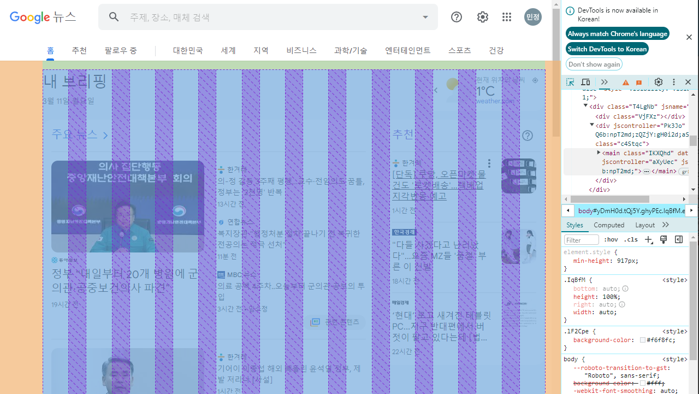
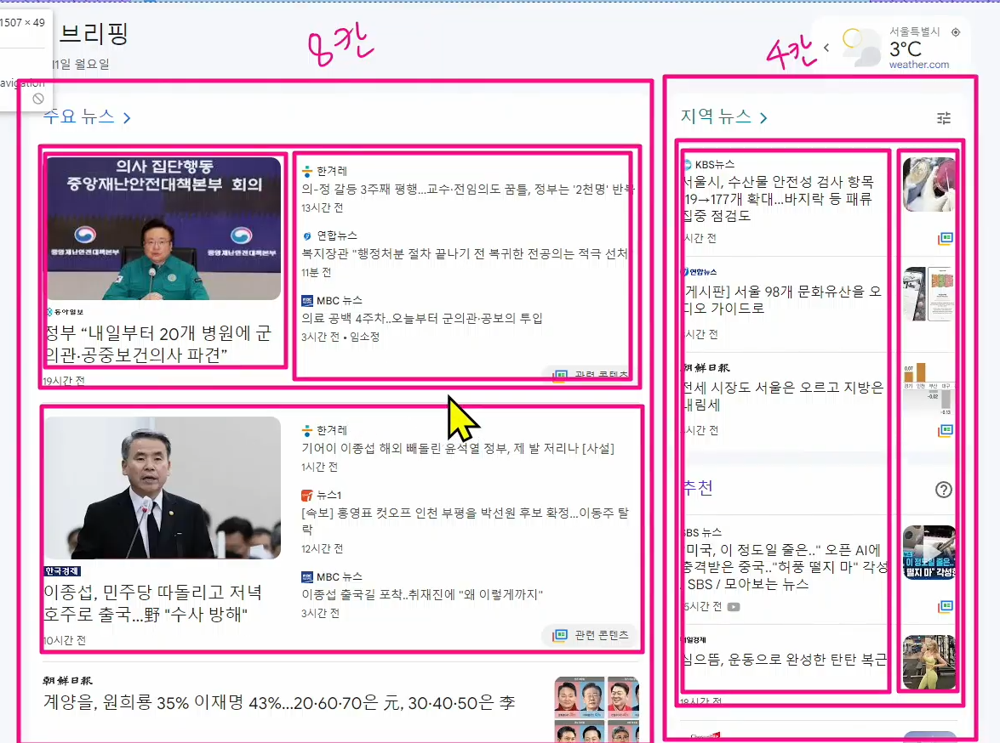
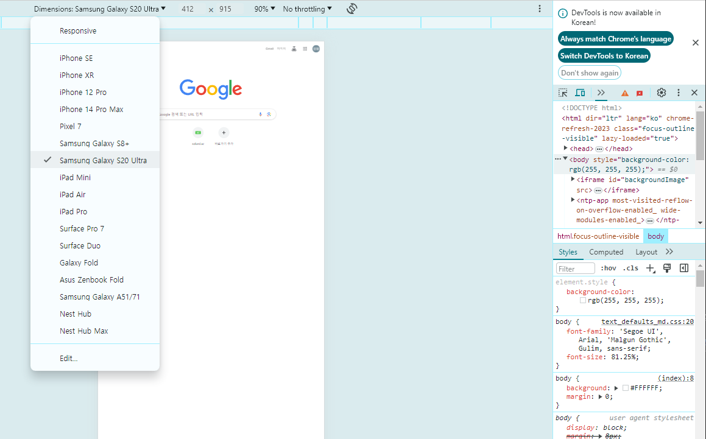

# Responsive Web

## [emmet](https://docs.emmet.io/)
`div>.container>h1{Hello}+nav>ul>li*5>a{Link $}`
하면 

```html
<div>
    <div class="container">
        <h1>Hello</h1>
        <nav>
            <ul>
                <li><a href="">Link 1</a></li>
                <li><a href="">Link 2</a></li>
                <li><a href="">Link 3</a></li>
                <li><a href="">Link 4</a></li>
                <li><a href="">Link 5</a></li>
            </ul>
        </nav>
    </div>
</div>
```

이렇게 자동완성을 해준다 
. 과 >를 사용하는데 선택자와 결합자를 만들 때 사용했던것 


[Emmet cheat sheet](https://docs.emmet.io/cheat-sheet/)


## 단축키 

`ctrl + l` : 한줄 선택 
`ctrl + d` : 동일한 단어 검색 
`ctrl + h` : 단어검색 후 변경가능
`ctrl + alt + 화살표` : 멀티 커서  
`alt + 클릭` : 멀티 커서 
`alt + 화살표` : 선택한 라인 끌고가기
`alt + shift + 화살표` : 선택한 줄 복사붙여넣기


## BootStrap Grid System 
웹 페이지의 레이아웃을 조정하는데 사용되는 **12개의 컬럼**으로 구성된 시스템 (약수가 많아서 12개로 한다)
- 목적
    반응형 디자인을 지원해 웹 페이지를 모바일, 태블릿 데스크탑등 다양한 기기에서 적절하게 표시할 수 있도록 도움




### 반응형 웹 디자인
디바이스 종류나 화면 크기에 상관없이, 어디서든 일관된 레이아웃 및 사용자 경험을 제공하는 디자인 기술


1. container
- column들을 담고 있는 공간
2. column 
- 실제 컨텐츠를 포함하는 부분
3. gutter
- 컬럼과 컬럼 사이의 여백

1개의 Row 안에 12개의 Column영역이 구성 


##
1. nest
2. offset
    - 공백을 주는 형태 
    - 비


### gutters
grid system에서 column사이에 여백 영역 x 축은 padding, y축은 margin으로 여백 만듦

### The grid system 
- css가 아닌 편집 디자인에서 나온 개념으로 구성 요소를 잘 배치해서 시각적으로 좋은 결과물을 만들기 위함
- 기본적으로 안쪽에 있는 요소들의 오와 열을 맞추는 것에서 기인
- 정보 구조와 배열을 체계적으로 작성하여 정보의 질서를 부여하는 시스템

## Grid system for responsive web
- bootstrap grid system에서는 12개 column과 6개 breakpoints를 사용하여 반응형 웹디자인을 구현 

### Grid sytem breakpoints
웹페이지를 다양한 화면 크기에서 적절하게 배치하기 위한 분기점 
-> 화면 너비에 따라 6개의 분기점 제공

|size|container|class prefix|
|------|---|---|
|xs|none|.col-|
|sm|540px|.col-sm-|
|md|720px|.col-md-|
|lg|960px|.col-lg-
|xl|1140px|.col-xl-
|xxl|1320px|.col-xxl-


```html
<h2 class="text-center">Breakpoints</h2>
  <div class="container">
    <div class="row">
      <div class="box col-12 col-sm-6 col-md-2">
        col
      </div>
      <div class="box col-12 col-sm-6 col-md-8">
        col
      </div>
      <div class="box col-12 col-sm-6 col-md-2">
        col
      </div>
      <div class="box col-12 col-sm-6 col-md-12">
        col
      </div>
    </div>
```
너비 576이상이면 2줄로 바꾼다 

오프셋 사이즈가 변해도 4칸에 대한 상쇄가 진행되고 있다. 

### media Query 로 작성된 grid system의 breakpoints
픽셀값을 여기서 확인해서 고쳐야한다. 




## CSS layout 종합정리

```html
<div class="row row-cols-1 row-cols-md-2 g-4">
  <div class="col">
    <div class="card">
      
      <div class="card-body">
        <h5 class="card-title">Card title</h5>
        <p class="card-text">This is a longer card with supporting text below as a natural lead-in to additional content. This content is a little bit longer.</p>
      </div>
    </div>
  </div>
  <div class="col">
    <div class="card">
      
      <div class="card-body">
        <h5 class="card-title">Card title</h5>
        <p class="card-text">This is a longer card with supporting text below as a natural lead-in to additional content. This content is a little bit longer.</p>
      </div>
    </div>
  </div>
  <div class="col">
    <div class="card">
      
      <div class="card-body">
        <h5 class="card-title">Card title</h5>
        <p class="card-text">This is a longer card with supporting text below as a natural lead-in to additional content.</p>
      </div>
    </div>
  </div>
  <div class="col">
    <div class="card">
      
      <div class="card-body">
        <h5 class="card-title">Card title</h5>
        <p class="card-text">This is a longer card with supporting text below as a natural lead-in to additional content. This content is a little bit longer.</p>
      </div>
    </div>
  </div>
</div>
```

`row row-cols-1 row-cols-md-2 g-4` : 

### 더 배워보기
- 인스타그램, 넷플릭스 클론코딩을 하면서 공부하기 
- [WEBDEV](https://web.dev/)